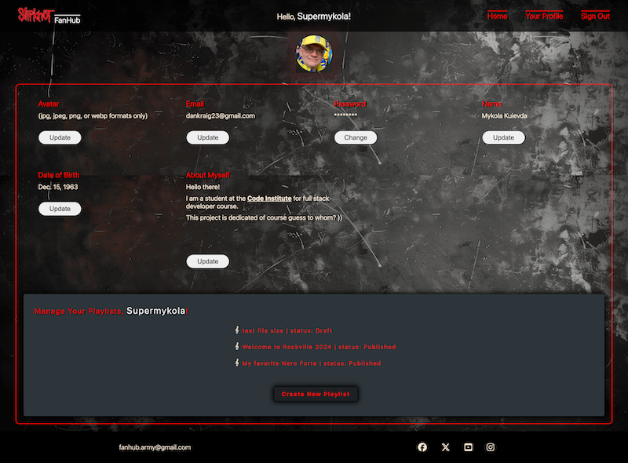

# slipknot-fan-hub
Join the legion of Slipknot loving Maggots! This community-driven site is a gathering place for Slipknot fans. All built on a reliable tech stack including Django and a relational database.
You can enter the realm [here](https://slipknot-fan-hub-fe591bad3f33.herokuapp.com/).

## Round and About

Slipknot FanHub is a platform where fans can create and share personalized playlists. These playlists can include a variety of Slipknot-featured, Slipknot-related or Slipknot-inspired items such as:

- Songs: From original Slipknot tracks to covers, remixes and tutorials.
- Reference Links: direct access to Slipknot's discography, interviews, and more.
- Images: concert photos, fan art, and behind-the-scenes snapshots.
- Audio Files: Live recordings, fan-made tributes, and exclusive audio content.
- Documents: Tutorials, song analyses, and personal stories.

**Share Your Passion**

The platform allows fans through their Playlist and Playlist Items to share their impressions, emotions, and personal experiences related to Slipknot. Whether it's a memory from a live show, a deep dive into the lyrics, or a tutorial on how to play their favorite riff, Slipknot FanHub is the place to express their devotion.

## FEATURES

### Exploring flows of Non-Authenticated User

- Landing Page grid-ish wireframe

*__Signin / Signup navigation bar__*

Landing navbar for non-authenticated user consists of:
- Home
- SignUp

- Login

*__Entry to Round and About Section through Banner 1__*

*__Entry to Full List of Shared Playlists through side Banner 2__*

*__Entry to Playlist Detail view through one of the Playlist Cards__*

*__Entry to Playlist Author Presentation view through Author's avatar and username link__*

*__Playlist Item Detail Preview__*

*__Pagination Tool in the Footer__*

Turns pages 5 playlist cards per page.

### Exploring flows of Authenticated User

*__Header Navigation Block changes to Signed__*

When signed in, User is granted more options:
- create and manage User profile: 
  - add and change Avatar image
  - reset Email
  - reset Password
  - add Full Name
  - add Date of Birth
  - add About Myself information  
- comment on Shared Playlists 
- like and unlike (cancel previous like) both Shared Playlist and Comments
- create, edit, delete Playlists and add, edit, delete Items to Playlists
- share created playlists to FanHub community. Shared Playlists are accessible for preview:
  - from the home page (by clicking titles of Playlist cards)
  - from the Shared Playlists (full list)
  - from Playlist Author presentation page (links that Author's playlists) 

*__User Profile Page__*

*__User Form to update About Myself information__*

*__Manage Your Playlists page__*

*__Playlist Detail View for Creating, Updating or Deleting Playlists__*

*__User Form to Create Playlists__*

*__User Form to Add Item to a Playlist__*

## Project Planning

### User Stories

The buildup of basic functionalities for this project was based on User Stories. 
The project User Stories can be reviewed on my GitHub Repository [here](https://github.com/Mykola-CI/slipknot-fan-hub/issues)

### ERD - Database Schema

This schema shows relation connections between models and fields structure. 

### Notes to Data Modeling.

**- UserProfile model**

Created to extend the built-in Django User model. It adds to the standard fields of the User model such fields as 

| Field name | Field type | Status | Validator |
| ---- | ---- | ---- | ---- |
| user | OneToOneField | related to User | on_delete=models.CASCADE |
| about_myself | TextField | not required | max. num. of characters 1000 |
| avatar | CloudinaryField | not required | image, other validators set on the form and view levels |
| date_of_birth | DateField | not required | null=True |

As it is One-To-One mandatory related to its parent User model it requires a signal set to create UserProfile instance whenever is a new User instance created. [signals.py](user_profile/signals.py).

**- Playlist model**

Created to store the data for a particular User Playlist as umbrella data common for all items which can be added to that Playlist.
| Field name | Field type | Status | Validator |
| ---- | ---- | ---- | ---- |
| title | Charfield | required | max_length=200 |
| slug | SlugField | not required, auto | unique |
| author | ForeignKey | related to User | on_delete=models.CASCADE |
| featured_image | CloudinaryField | not required | image, other validators set on the form and view levels |
| description | TextField | not required | MaxLengthValidator(1000) |
| reference_url | URLField | not required | |
| created_on | DateTimeField | | auto_now_add=True |
| status | IntegerField | not required | as per STATUS choices, default = 0 |
| updated_on | DateTimeField | | auto_now=True |

**STATUS choices** are crucial for the site concept as it is constitutes whether a Playlist is Shared (Published) or Not, the latter one meaning it is in the draft mode:

STATUS = ((0, "Draft"), (1, "Published"))

**A NOTE ON THE PLAYLIST SLUG FIELD.** It is not required from a User, however, every Playlist instance is supplied with 'slug' automatically using **Slugify** django package and a custom **save method** of the Playlist model that overrides the standard one.

This [save method](user_profile/models.py) ensures that 
- titles are converted to slugs automatically
- check if a title has changed to update a slug
- slug is unique by checking existing slugs and if it exists adding 1 to modify the slug 

The title and description are supposed to give some message to fellow fan community as to what this Playlist is about.
Playlist by itself can be published without any Items anyway, just to express emotions or share thoughts and facts by using merely a description field and URL reference field.

**- PlaylistItem model**

Created to store the data for a particular Item that is added to a Playlist as a content to support a Playlist idea from a User perspective.

| Field name | Field type | Status | Validator |
| ---- | ---- | ---- | ---- |
| song_title | Charfield | required | max_length = 200 |
| artist | Charfield | required | max_length = 200 |
| album | CharField | not required | max_length = 200 |
| song_audio | CloudinaryField |  not required | 'raw' type, other validators set on the form and view levels |
| song_tabs | CloudinaryField | not required | 'raw' type, other validators set on the form and view levels |
| song_comments | TextField | not required | MaxLengthValidator(800) |
| performance_year | IntegerField | not required | null=True |
| performance_type | IntegerField | not required | as per STATUS choices, default=0 |
| created_on | DateTimeField | auto | auto_now_add=True |
| updated_on  | DateTimeField | auto | auto_now=True |

Regarding **performance_type** Author User is given choices:

TYPE = ((0, "Original"), (1, "Cover"), (2, "Tutorial"), (3, "Inspired"))

**- PlaylistPost model**

| Field name | Field type | Status | Validator |
| ---- | ---- | ---- | ---- |
|playlist | OneToOneField | related to Playlist | on_delete=models.CASCADE |
| slug | SlugField | auto copied from Playlist.slug | unique=True, null=False |
| likes | ManyToManyField | related to User | blank=True |
| created_on | DateTimeField | auto | auto_now_add=True |
| updated_on | DateTimeField | auto | auto_now=True |

PlaylistPost model serves functionality of Playlist being _shared_ or in other words _published_. 

It eventually does not store Playlist details but rather details about Playlist being _published_, such as date of publication, and _likes_ received.

It is equipped by **total_likes** count method. Refer [Core models](core/models.py).

Similar to the UserProfile - User models relations PlaylistPost is One-To-One mandatory related to its parent Playlist model. Thus, it requires a signal set to create and/or update PlaylistPost instance whenever a user decides to publish user's Playlist. [signals.py](core/signals.py).

**A SPECIAL NOTE ON THE PLAYLISTPOST SLUG FIELD.** PlaylistPost does not need a title or any other musical details as it is merely a vehicle for a Playlist to appear on the FanHub board. However, it does need a unique slug as an important URL element for PlaylistPost views. Slug is copied from Playlist model to PlaylistPost model making them identical by means of the same signal that creates PlaylisPost instances:\
 [signals.py](core/signals.py) - `PlaylistPost.objects.create(playlist=instance, slug=instance.slug)`

**- Comment model**

| Field name | Field type | Status | Validator |
| ---- | ---- | ---- | ---- |
| playlist_post | ForeignKey | related to PlaylistPost | on_delete=models.CASCADE |
| author | ForeignKey | related to User | on_delete=models.CASCADE |
| content | TextField | required | MaxLengthValidator(500) |
| likes_comment | ManyToManyField | related to User | |
| created_on | DateTimeField | auto | auto_now_add=True |
| updated_on | DateTimeField | auto | auto_now=True |

It is also equipped by 
- **total_likes** count method. Refer [Core models](core/models.py).
- **getter and setter** methods to check the like status of a comment and serve it for the playlist_post_detail template

**- ModeratorSection model**

It serves Round an About page and the needs of superuser or moderator.\
It can be updated via admin console only and has no relational fields.

| Field name | Field type | Status | Validator |
| ---- | ---- | ---- | ---- |
| title | CharField | required | max_length=200 |
| profile_image | CloudinaryField | required | 
| updated_on | DateTimeField | auto | auto_now=True
| content | TextField | not required | |
| reference_url | URLField | not required | |
| about | TextField | not required | |

### Agile Project Planning 

My Kanban Board can be found on my GitHub [here](https://github.com/users/Mykola-CI/projects/5)

## Testing

For the testing documentation and descriptions please refer to [TESTING.md](TESTING.md)

## Technologies used

- ### Languages:
    
    - [Python 3.11.7](https://www.python.org/downloads/release/python-3117/): develop the server-side of the website.
    - [JS](https://www.javascript.com/): develop interactive components of the website.
    - [HTML](https://developer.mozilla.org/en-US/docs/Web/HTML): the markup for the website.
    - [CSS](https://developer.mozilla.org/en-US/docs/Web/css): the styling language.

- ### Frameworks and libraries:

    - [Django](https://www.djangoproject.com/): python framework used to create all the logic.
    - [jQuery](https://jquery.com/): control button click events and send AJAX requests.

- ### Databases:

    - [PostgreSQL](https://www.postgresql.org/): the database tool.

- ### Other tools:

    - [Git](https://git-scm.com/): the version control system.
    - [Pip3](https://pypi.org/project/pip/): the package manager.
    - [Gunicorn](https://gunicorn.org/): webserver to run the website.
    - [Python Dotenv](https://pypi.org/project/python-dotenv/): serve environment variables.
    - [Psycopg2](https://www.python.org/dev/peps/pep-0249/): used as a database connector.
    - [Django-allauth](https://django-allauth.readthedocs.io/en/latest/): the authentication library for user accounts management.
    - [Heroku](https://heroku.com/): the cloud platform to host the website.
    - [WhiteNoise](https://whitenoise.readthedocs.io/en/latest/index.html): serve static files on heroku.
    - [Django Summernote](https://pypi.org/project/django-summernote/): provide for richtext in textarea inputs
    - [ElephantSQL](https://www.elephantsql.com/): the cloud database to store the data.
    - [GitHub](https://github.com/): host the website's source code.
    - [VSCode](https://code.visualstudio.com/): the IDE to develop the website.
    - [Chrome DevTools](https://developer.chrome.com/docs/devtools/open/): debug the website, check html, styles and js.
    - [Firefox Developer Edition](https://www.mozilla.org/en-GB/firefox/developer/): debug the website, check html, styles, responsive design.
    - [Font Awesome](https://fontawesome.com/): create the social media icons used in the website.
    - [Draw.io](https://www.drawio.com/): make a database schema for the README file.
    - [Gimp](https://www.gimp.org/): to process images for the website.
    - [Midjorney](https://www.midjourney.com/home): AI tool to create custom banners for the website.
    - [W3C Validator](https://validator.w3.org/): was used to validate HTML5 code for the website.
    - [W3C CSS validator](https://jigsaw.w3.org/css-validator/): was used to validate CSS code for the website.
    - [JShint](https://jshint.com/): was used to validate JS code for the website.
    - [PEP8](https://pep8.org/): was used to validate Python code for the website.

## Credits

