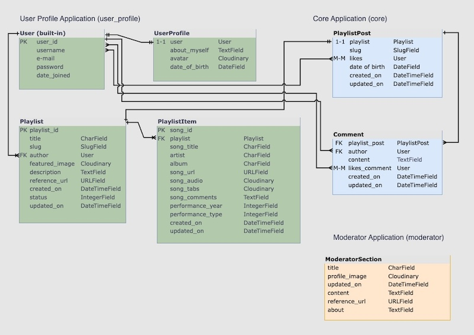

# slipknot-fan-hub
Join the legion of Slipknot loving Maggots! This community-driven site is a gathering place for Slipknot fans. All built on a reliable tech stack including Django and a relational database.
You can enter the realm [here](https://slipknot-fan-hub-fe591bad3f33.herokuapp.com/).

## Round and About

Slipknot FanHub is a platform where fans can create and share personalized playlists. These playlists can include a variety of Slipknot-featured, Slipknot-related or Slipknot-inspired items such as:

- Songs: From original Slipknot tracks to covers, remixes and tutorials.
- Reference Links: direct access to Slipknot's discography, interviews, and more.
- Images: concert photos, fan art, and behind-the-scenes snapshots.
- Audio Files: Live recordings, fan-made tributes, and exclusive audio content.
- Documents: Tutorials, song analyses, and personal stories.

**Share Your Passion**

The platform allows fans through their Playlist and Playlist Items to share their impressions, emotions, and personal experiences related to Slipknot. Whether it's a memory from a live show, a deep dive into the lyrics, or a tutorial on how to play their favorite riff, Slipknot FanHub is the place to express their devotion.

## FEATURES

### Exploring flows of Non-Authenticated User

- Landing Page grid-ish wireframe

*__Signin / Signup navigation bar__*

Landing navbar for non-authenticated user consists of:
- Home
- SignUp

- Login

*__Entry to Round and About Section through Banner 1__*

*__Entry to Full List of Shared Playlists through side Banner 2__*

*__Entry to Playlist Detail view through one of the Playlist Cards__*

*__Entry to Playlist Author Presentation view through Author's avatar and username link__*

*__Playlist Item Detail Preview__*

*__Pagination Tool in the Footer__*

Turns pages 5 playlist cards per page.

### Exploring flows of Authenticated User

*__Header Navigation Block changes to Signed__*

When signed in, User is granted more options:
- create and manage User profile: 
  - add and change Avatar image
  - reset Email
  - reset Password
  - add Full Name
  - add Date of Birth
  - add About Myself information  
- comment on Shared Playlists 
- like and unlike (cancel previous like) both Shared Playlist and Comments
- create, edit, delete Playlists and add, edit, delete Items to Playlists
- share created playlists to FanHub community. Shared Playlists are accessible for preview:
  - from the home page (by clicking titles of Playlist cards)
  - from the Shared Playlists (full list)
  - from Playlist Author presentation page (links that Author's playlists) 

*__User Profile Page__*

*__User Form to update About Myself information__*

*__Manage Your Playlists page__*

*__Playlist Detail View for Creating, Updating or Deleting Playlists__*

*__User Form to Create Playlists__*

*__User Form to Add Item to a Playlist__*

## Project Planning

### User Stories

The buildup of basic functionalities for this project was based on User Stories. 
The project User Stories can be reviewed on my GitHub Repository [here](https://github.com/Mykola-CI/slipknot-fan-hub/issues)

### Database Schema

This schema shows relations between models. 

### Agile Project Planning 

My Kanban Board can be found on my GitHub [here](https://github.com/users/Mykola-CI/projects/5)

## Credits

