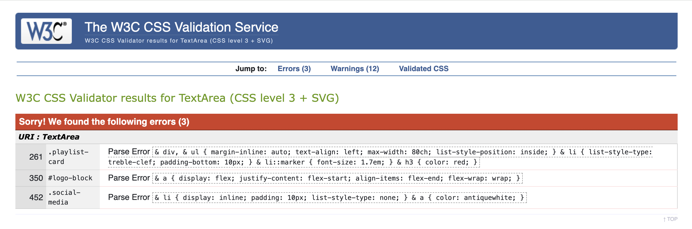

# Testing
## Validator Testing
### W3C HTML

Technique used for validating html in production site (heroku): 

Navigate to a page in Chrome / Chrome Inspect mode / View Page Source / Copy html / Paste to W3C html validator - direct input.

* __Info Messages__

There are html validator messages regarding trailing slash endings as  self-closing tags for the void elements. These are neither errors nor warnings. This issue has been widely covered throughout developer communities. It is said that trailing slashes may cause issues with unquoted attribute values, whereas self-closing tags are required in XHTML ([Mdn reference](https://developer.mozilla.org/en-US/docs/Glossary/Void_element)). 

I do not use unquoted attribute values, and I confirmed that these kinds of tags do not cause any bugs.

- Home page

- Round And About page

- All Shared Playlists page

- Playlist Detail Presentation page  

- Playlist Author Presentation page

- User Profile page

- Manage Playlists page

- User's Playlist Detail Review page

- Playlist Create page

- Playlist Update page

- Playlist Delete page

- Add Playlist Item

- Update Playlist Item page

- Delete Playlist Item page

### W3C CSS
I use 5 CSS files to serve web-pages in my applications. 

- `style.css` - accessible across all applications
- `profile.css` - serving User profile pages
- `playlist_update.css` - serving User Playlist management pages
- `core_styles` - serving Home page and Playlist Detail pages (accessible for non-logged in users)
- `base_allauth.css` - custom restyling of django-allauth pages. 

__Explanation of Errors Revealed in Validator Results:__

All of the parse errors reported by W3C CSS validator are related to 'CSS nested rules', which the validator does not yet support, the 'nested CSS' syntax being a relatively new feature. The issue has been discussed in a number of places, particularly on GitHub issues , Reddit and some other less popular blogs.

It is acknowledged that such approach as CSS nesting reduces redundancy and simplifies the management of complex styles, leading to cleaner and more organized code. Additionally, CSS nesting aligns with the principles of modular design, which is especially in demand for complex and large-scale projects.
Moreover, CSS nesting is supported by all major modern browsers: 

| Browser Name: | Full support from: | Version released in: |
| ---- | ---- | ---- |
| Chrome | version 120 | released in 2023 |
| Edge | version 120 | released in 2023 |
| Firefox | version 117 | released in 2023 |
| Safari | version 17.2 | released in 2023 |
| Opera | version 106 | released in 2023 |
| Chrome for Android | version 125 | released in 2024 |
| Safari on iOS | version 17.2 | released in 2023 |
| Samsung Internet | version 25 | released in 2024 |
| Opera Mobile | version 80 | released in 2023 |
| Firefox for Android | version 126 | released in 2024 |

[Link to 'Can I Use' reg Nesting Selector](https://caniuse.com/mdn-css_selectors_nesting)

[Using CSS Nesting Selector MDN](https://developer.mozilla.org/en-US/docs/Web/CSS/CSS_nesting/Using_CSS_nesting)

In order to avoid ambiguities and ensure that styles are applied as intended across different browsers I used `&` nesting selector. It is said that using the `&` nesting selector helps prevent issues with compound selectors and pseudo-classes, which can be sensitive to whitespace and other syntactical nuances

[MDN '&' Nesting selector uses](https://developer.mozilla.org/en-US/docs/Web/CSS/CSS_nesting/Nesting_at-rules)

__Validation Results__

- style.css

- profile.css

- playlist_update.css

- core_styles.css

- base_allauth.css

### JSHint Validator
- comments.js

- item-detail-toggle.js

- user-profile.js

__A note on "undefined variable" warning in user_profile.js__

In fact, it is dynamically defined inside a template because external .js files do not support Django template language.

This is the snippet from `profile.html`:

~~~





~~~

### Python Linter
I used the validator provided by the Code Institute [here](https://pep8ci.herokuapp.com/).

I have checked all python-based files on PEP8 integrity and can guarantee that there are no errors found, with one exception. These are commonly known lines in Django settings:
~~~
AUTH_PASSWORD_VALIDATORS = [
    {
        "NAME": "django.contrib.auth.password_validation.UserAttributeSimilarityValidator",
    },
    {
        "NAME": "django.contrib.auth.password_validation.MinimumLengthValidator",
    },
    {
        "NAME": "django.contrib.auth.password_validation.CommonPasswordValidator",
    },
    {
        "NAME": "django.contrib.auth.password_validation.NumericPasswordValidator",
    },
]
~~~

I left them unscathed for better readability. After all, according to [PEP 8 – Style Guide for Python Code](https://peps.python.org/pep-0008/) "A Foolish Consistency is the Hobgoblin of Little Minds".

As far as there are too many python files in the project I do not deliver screenshots of successful tests here.

## Lighthouse

- Performance 85% is not so good because of the 'Largest Contentful Paint' which takes most of time delay. I do not dare to reduce quality to the worse anymore.
- Best practices ranked 78% due to cookies coming from images imposed by Cloudinary.  

However, in comparison to Slipknot original home site it is much better.

## Manual Testing

### Basics
All references to User Stories are numbered as per my [GitHub Issues](https://github.com/Mykola-CI/slipknot-fan-hub/issues) for the project. 

| num. | Test Name | Purpose | User Story | Findings
| ---- | ---- | ---- | ---- | ---- |
| 1 | Valid Entries/signup | Check if User is created | #1 | User created, confirmed through 'admin' console | 
| 2 | No email/signup | Check if User is created | #1, #58 | User not created, form does not submit, popup message 'please fill in this field' |
| 3 | Invalid email/signup | Check if User is created | #1, #58 | User not created, form does not submit, popup 'please enter an email address' |
| 4 | non-existent email/signup | Check if User is created | #1, #58 | Form submitted, 'Verify Your Email Address' page opens, Trying to signin without verification fails |
| 5 | Existing username at signup | Check if form submits and messages | #5 |  form does not submit, message: A user with that username already exists. |
| 6 | 1-4 tests for login page | Check if User can login, check messages | #6, #10 | User can login only when valid credentials are filled in, other scenarios raise appropriate messages or popups |
| 7 | Password reset | Check if User can reset password | #8 | Click on 'forget your password' link, email sent with a reset link, clicking reset link opens a password reset page, upon submit password changes successfully, User login with new password confirmed |  
| 8 | Add About Myself - invalid | Check more than 1000 char | #15 | Error: "Ensure this value has at most 1000 characters (it has 1986)." |
| 9 | Add About Myself - valid | Check if about info is saved to the database | #15 | Info is stored and displayed in appropriate views |
| 10 | Playlist CRUD | Check if all CRUD changes are saved to the database | #17 | All changes are saved successfully, checked all available fields including image and ref. url |
| 11 | Playlist Item CRUD | Check if all CRUD changes are saved to the database | #18, 19, 20 | All changes are saved successfully, checked all available fields including file uploads and ref. url |
| 12 | Upload of audio file | Check if the form has tools for upload and a file is saved to the database | #19 | Form contains a 'browse' tool to select and upload file, checkbox to clear file, 'change' button to change file, file is saved to the database |
| 13 | Share a Playlist | Check if hitting the button 'Share Playlist' displays the Playlist on home page and on Shared Playlists page | #21 | Button text turn to 'Remove playlist from FanHub', Playlist and its details appear on relevant pages for presentation |
| 14 | Share a Playlist | Check if hitting the button 'Remove Playlist' removes a Playlist from the home page and from the Shared Playlists page | #22 | Button text turn to 'Share playlist to FanHub', Playlist is removed from all pages for presentation but remain seen form user profile pages, status changes to 'Draft' from 'Published' |
| 15 | Create Comment | Check if an appropriate form is available for logged-in users | #24, #56 | Comment Form is available for logged users only on Playlist Post Detail page, and to the contrary, it is not available for those who is not logged |
| 16 | Create and save Comment | Check if a new comment is saved to the database | #24 | Comment is saved upon submission of the form, comment content is displayed in Playlist Post Detail view  |
| 17 | Edit comment | Comment can be edited and changes saved | #25 |  button 'edit' appears only next to user's own comments, existing content of a comment populates editable textarea, content can be edited, changes are saved successfully upon submission, updated comment appears on the Post Detail View page |
| 18 | Delete a comment | Comment can be deleted and record is removed from the database | #48 | button 'delete' along with 'edit' appear only next to user's own comments, pop up modal with a request to confirm delete appears when delete is clicked, when confirmed a comment is no longer seen in the comment section |
| 19 | Like shared playlist | Check highlight of like button, saving into the database, increase of like count | #50 | Button highlighted red, liked status is saved - checked through admin console, like count display increases by 1 |
| 20 | Unlike shared playlist | Check if highlight of like button removed, saving into the database, decrease of like count | #49 | Red highlight removed, liked status is cancelled - checked through admin console, like count display decreases by 1 |
| 21 | Like and unlike comment | similar to 19 and 20 for playlists | #51, 52 | all tests here successful |
| 22 | Total likes count | Check if total count counts and displays for both Playlist posts and comments | #53, 54 | Displayed as expected on home page inside playlist cards, and on Playlist Detail view, count increases by 1 when liked and decreases when unliked |
| 23 | Moderator to control content | Superuser and moderator if any are enabled with CRUD for database items | #39 | Content can be changed via admin console successfully, currently there is only one account with all discretion rights - superuser | 
| 24 | Upload and save avatar | Check if avatar image can be uploaded and saved | #44, 45, 46 | Form is rendered, file uploads successfully to Cloudinary, avatar is displayed in user profile and in playlist detail views |
| 25 | Upload and save doc file | Check if file uploads and saved in database | #47 | Form allows to upload doc file, file saved successfully, if .txt or .pdf file uplaoded preview is allowed by Cloudinary, other types of files download to local user's computer |
| 26 | Moderator to update about section | Check if updates made to about page via admin console saves correctly | #55 | Round and About page can be edited via admin console in rich text format, saves successfully |
| 27 | Authorised users only can edit their playlists | Check if a user can access somebody else's playlist to edit | #57 | Non-logged user gets to signin page first, if a logged-in user explicitly dials url specific to somebody else's playlist or a playlist item such user hits a 403 page "access denied" |
| 28 | Email required at signup | Check if a user can register an account without filling in user's email and without verification | #58 | If email is not filled in form does not submit; if email is faked and never verified, superuser receives notification that email does not exists, if it exists but not verified, account is not registered and user cannot login | 

### User File Uploads validation and crash testing

| num. | Form | Test Case | Findings |
| ---- | ---- | ---- | ---- |
| 29 | Upload Avatar image | File type .txt | Error pop-up, message: Raw file format txt not allowed / try allowed formats: jpg, png or webp |
| 30 | Upload Avatar image | file type .jpg size over 20MB | Error pop-up: "Your file size 24396919 bytes is too large. Max allowed size is 10400000 bytes." |
| 31 | Update Playlist | uploading featured banner file type .mp3 | Form does not submit. Error message displayed on the form page: Error uploading featured image: Image file format mp3 not allowed |
| 32 | Update Playlist | uploading featured banner file .jpg size 24.4MB | Form does not submit. Error message displayed on the form page: Your file size 24396919 bytes is too large. Max allowed size is 10400000 bytes. |
| 33 | Update Playlist | featured banner .png 8.4MB | Saves successfully. resized by Cloudinary widgets to 108.4KB - confirmed on Cloudinary Media Library |
| 34 - 36 | Create Playlist | the same test cases as 31-33 | the same errors and messages, no crashes | 
| 37 | Playlist Item Update | audio file of large size 32MB | The form page stays on. Error displayed:  Your file size 13933485 bytes is too large. Max allowed size is 8388608 bytes. |
| 38 | Playlist Item Update | audio file of size less than 10MB (Cloudinary server limit) but larger than max allowed 8MB | The form page stays on. Error displayed:  Your file size 9289965 bytes is too large. Max allowed size is 8388608 bytes. | 
| 39 | Playlist Item Update | test file of type .webp upload to song_audio | The form page stays on. Error displayed: Error uploading song audio: Image file format webp not allowed | 
| 40 | Playlist Item Update | test file of type .pdf of size 6MB load to song_tabs | The form page stays on. Error displayed: Your file size 6352205 bytes is too large. Max allowed size is 5242880 bytes. | 
| 41 | Playlist Item Update | test file of type .aac load to song_tabs | The form page stays on. Error displayed: Error uploading song tabs: Image file format aac not allowed | 
| 42-46 | Add Playlist Item (new) | the same test cases | the same results as expected |

### JavaScript segments testing
| num. | View | Test Case | Findings |
| ---- | ---- | ---- | ---- |
|  | | |**comments.js** |
| 47 | Playlist Detail View Comments Section | Edit button responses | Form title changes to Edit Comment, Button text changes to 'Save Changes', 'Discard Changes' appear underneath save changes button, TextArea is populated with the existing comment content |
| 48 | Playlist Detail View Comments Section | Delete button responses | Modal shows with the question 'Are You Sure?' and 'confirm delete' button, clicking outside or 'X' sign closes the modal without deleting comment |
|  | | | **item-detail-toggle.js** |
| 49 | Playlist Detail View Songs Section | Toggle Burger Icon responses | Modal Article shows with song details, and hides when Burger Icon is hit repeatedly, if other song is opened the other song closes, if audio playing from other song it stops playing |
| 50 | Playlist Detail View Songs Section | Play audio volume levels | Set at 0.2 whenever it opens for the first time during user session |
| | | | user-profile.js |
| 51 | user_profile view | tested manually in Basics and in Django unittesting of relevant view | this captures form data type correctly and sends ajax GET request to render relevant form, and ajax POST request to submit it |

.\
.

_**Testing JavaScript serving Edit Comment**_

_**Testing JavaScript serving Delete Comment**_

.\
.
## Django Unit Testing

Due to the pressing deadline and the substantial number of files, I focused on the most complex test cases. This approach aimed to augment and enhance the outcomes of manual testing rather than duplicate the more obvious scenarios.

### User Profile AJAX-based View.
- __Testing form rendering__

| Test name | Goals |
| --- | --- |
| test_get_email_form | Checking the presence of the mock email address and the label title in the response content |
| test_post_email_form_valid | Checking if form is submitted with valid e-mail address|
| test_post_email_form_invalid | Checking if form is submitted with invalid email address to return error status |
| test_post_name_form_valid | Checking form submit for first and last name |
| test_post_dob_form_valid | Checking form submit for date of birth |
| test_post_about_form_valid | Checking form submit for 'about myself' section |
| test_post_avatar_form_valid | checking form submit for avatar upload |
| test_profile_view_unauthenticated | Testing the profile view for an unauthenticated user. I tried to simulate logging out and then accessing the profile page. Expectation is a redirect to the login page and after that to 'profile' |
| test_profile_view_authenticated | Testing the profile view for an authenticated user. I am checking the response status code and the title of the page |

- __Testing context rendering__

| Test name | Goals |
| --- | --- |
| test_profile_context | Testing status 200, template name and rendering contexts: user_profile, playlists, email_form, password_form, name_form, dob_form, about_form, avatar_form |

### User Playlist Views.

- __Playlist detail view test__

| Test name | Goals |
| --- | --- |
| test_unauthorized_user_access |  In fact, it is more testing the AuthorRequiredMixin and how it works in conjunction with the PlaylistCreatedView to restrict access of unauthorized user |
| test_context_data | Simply checking if the context data is correctly passed to the template |
| test_non_existent_playlist | Testing the case when the playlist does not exist and 404 error is raised |

- __Playlist update view test__

| Test name | Goals |
| --- | --- |
| test_logged_in_user_can_access_update_view |  Check if accessed by a logged-in user |
| test_non_logged_in_user_redirected_to_login | Check if NOT accessed by a non-logged-in user |
| test_non_author_user_cannot_access_update_view | Check if NOT accessed by a logged-in but not an author user |
| test_context_contains_playlist_items | Check if the context data is correctly passed to the template |
| test_valid_form_submission_updates_playlist | Test that a valid form submission updates the playlist |

- __Playlist Delete View test__

| Test name | Goals |
| --- | --- |
| test_redirect_if_not_logged_in |  Ensure that only authenticated users can access the view |
| test_logged_in_uses_correct_template | Check if a logged in user gets the correct template |
| test_playlist_deletion | Test if a playlist exists after deletion and user is redirected to '/profile/' page |

### Playlist Form Tests.
- __Form testing for create or update of a Playlist__

| Test name | Goals |
| --- | --- |
| test_form_valid_without_image | Testing if form is valid with mock user data but without image upload |
| test_form_invalid_missing_required_fields | Testing case when the required field 'title' is popped out of form_data set up in `setUp` method |
| test_form_valid_with_image | This test case concentrates on testing upload of avatar image to cloudinary. `@patch('cloudinary.uploader.upload')` is used to avoid error 'Invalid image file' |

- __Form testing for create or update of a Playlist Item__

| Test name | Goals |
| --- | --- |
| test_form_valid_with_files | Testing if form is valid with mock user data with non-image so-called raw files upload |
| test_form_valid_without_files | Testing if valid when no files uploaded |
| test_form_invalid_missing_required_fields | Testing when the required field `song_title` is popped out from a `setUp` dataset |

### User Profile Signal Test.

| Test name | Goals |
| --- | --- |
| test_user_profile_created | Test when a new user signs up a new related UserProfile instance is created |

### Core Blog Views Testing.

- __Home Page View testing__

| Test name | Goals |
| --- | --- |
| test_home_view_status_code | Just checking response status 200 |
| test_home_view_template_used | Checking if a correct template is rendered |
| test_home_view_pagination | Test that the home_view returns the correct number of posts - 5 per page |
| test_home_view_pagination_second_page | Test that the home_view returns the correct number of posts per 2nd page |
| test_home_view_pagination_last_page | Testing if last page contains the expected number of posts - 3 |
| test_home_view_out_of_range_page | Tests if 9999th page is called it defaults to the last page |
| test_home_view_context_data | Test context rendering |

- __Playlist Post Detail View Testing__

| Test name | Goals |
| --- | --- |
| test_get_context_data | checking context rendering for `playlist_post`, `playlist`, `author_profile`, `playlist_items`, `comments`, `comment_count`is simulated as 1, `comment_form` is rendered, and verifies that the `liked` context variable is `False` |
| test_post_valid_comment | Logs in user and sends a POST request with valid comment data. Asserts that the response status is 302 (redirect) and the new comment is created in the database |
| test_post_invalid_comment | Logs in user and sends a POST request with invalid comment data (empty text). Asserts that the response status is 200 and the correct template is used. Checks that the invalid comment is not created and the form errors are present in the context |

- Comment Delete View Testing

| Test name | Goals |
| --- | --- |
| test_comment_delete_by_author |  Logs in as the author of the comment. Sends a POST request to the comment_delete view. Asserts that the comment is deleted. Checks for the success message. Verifies that the response redirects to the post detail page. |
| test_comment_delete_by_non_author | Logs in as a different user who is not the author of the comment. Sends a POST request to the comment_delete view. Asserts that the comment is not deleted. Checks for the error message. Verifies that the response redirects to the playlist post detail page.

### Testing Signal for PlaylistPost Instance

| Test name | Goals |
| --- | --- |
| test_playlist_post_created_when_published | Test if PlaylistPost instance created when Playlist is set to "Published" |
test_playlist_post_slug_set_correctly | Test if PlaylistPost instance created and slug copied from the related Playlist instance correctly. I simulated the 'create' scenario, the previous_status explicitly defined |
| test_playlist_post_deleted_when_draft | Test if PlaylistPost instance deleted when Playlist is set to "Draft" - simulating removing Playlist from blog |
| test_playlist_post_slug_updated | Test if PlaylistPost instance slug updated when Playlist slug updated |
| test_playlist_post_created_when_published_from_draft | The method name is self-explaining. If user changes `status` variable from 0 (stands for "Draft") to 1 ("Published") an appropriate `slug` value must be assigned to PlaylistPost instance `slug` field |

## BUGS

In fact, there were so many bugs in this project to overcome that I am not sure how to filter them through. Mostly they were not so much bugs but rather attributes of taming and mastering this complex framework. 

1. APPLICATION CRASH AFTER INSTALLING DJANGO-ALLAUTH. SITE_ID PROBLEM.

After installation and configuring Django-allauth and setting localhost and heroku domains in admin console the server crashed without even usual Django debug error notifications. I could not start server and could not get access to admin console. Long plunge into the problem hinted that something was wrong with SITE_ID setting. 

In the result of try and error method I change the setting for SIT_ID to 2. It worked suddenly for me.
Then after a while I tested e-mail verifications and noticed that django-allauth sent messages on behalf of localhost. So I revisited the issue with SITE_ID value.

It appeared that when I manipulated with domains I unintentionally deleted the default domain and thus leaving ID=1 empty, NULL. I checked through Django shell IDs of existing domains. They appeared to be id=2 for localhost and id=3 for Heroku.

**Solution.** SITE_ID for production environment is set to 3 associated with production domain on Heroku.

2. CONTEXT CONFUSION BETWEEN USER 1 WATCHING PROFILE PRESENTATION OF USER 2

- User navigation flow. Problem description.

Suppose User 1 is watching the site. User 1 picks up a playlist shared by User 2 defined by context and by the database schema as `author` of that Playlist.

User 1 decides to have a look to the User's 2 profile and playlists. User 1 clicks on User's 2 avatar and gets to User profile presentation page. URL is not flawed and reveals the page of User 2.

However, on the header User 1 can see the greeting 'Hello, User 2', which is not good enough.

- Understanding the problem

I have set 2 navigation bars: for authenticated user and for non-authenticated user
~~~





~~~

`navbar-signed.html` displays a greeting to an authenticated user calling a name from the variable `{{ user.username }}`. That is the problem. 

When User 1 initiates URL leading to the profile of User 2, i.e. `'/presentation/user2/'` my navbar logic captures `user2` from url and greets User 2 that might confuse User 1.

**Solution** 

a) Set an explicit and robust context for user2 as an `author` of a playlist in contrast to User 1 as a current user.
~~~
user_profile = get_object_or_404(UserProfile.objects.select_related('user')user__username=username)
profile_user = user_profile.user
~~~
`user_profile` is an instance of the UserProfile model\
`profile_user` is a value of `username` field of User model One-to-One related to UserProfile model)\
In our case study `profile_user` is User 2.

b) set a variable calling a name of active and authenticated site User in navbar : `{{ request.user.username }}` as opposed to `user.username` using context processors `django.contrib.auth.context_processors.auth`. Thus we separate contexts entirely to avoid confusions. 